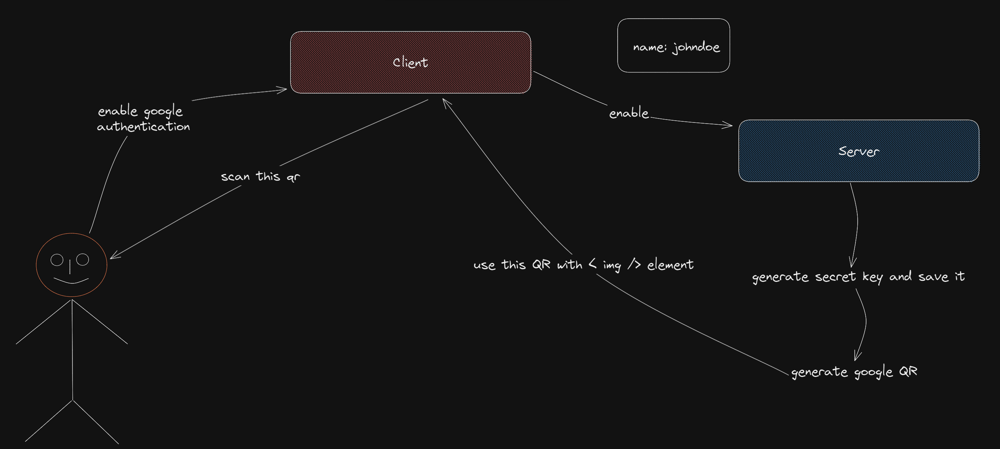
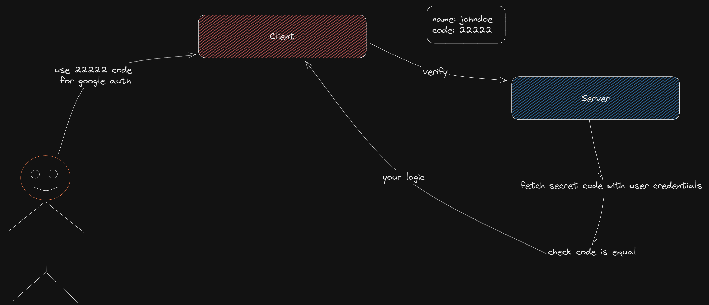

# G - Otp

G - Otp is a Golang client for Google Authenticator.

## Google Authenticator Logic

Google Authenticator uses a HMAC-based One-time Password Algorithm (HOTP) to generate a one-time password. The algorithm is described in RFC 4226. The algorithm uses a shared secret key and a counter value to generate a one-time password. The counter value is incremented after each password generation. The counter value is usually the current time in seconds divided by a time step. The time step is usually 30 seconds. The shared secret key is usually a random string of bytes. The shared secret key is usually stored in the user's mobile device. The one-time password is usually displayed to the user as a 6-digit number.

### With Lifecycle



First, you must create a secret key for the user. (Fear not, our gotp package will do it; just run it.)

Then you have to generate a qr code with secret key and some customizable data. (gotp will do that too, just run it.)

Then show the qr to the user and tell him to scan it from the Google Authenticator app.



Then wait for the user to enter a code.

When the user enters a code, tell gotp to verify it and give him the user's secret.

This will give you a boolean value. Then you can run the logic you want.

## Installation

```bash
go get github.com/ssibrahimbas/gotp
```

## Contributing

Contributions are always welcome!

## License

[MIT](https://choosealicense.com/licenses/mit/)

## Documentation

<docgen-index>

| **[`Variables`](#variables)**        |
|--------------------------------------|
| **[`gotp.Digits`](#digits)**         |
| **[`gotp.Algorithm`](#algorithm)**   |
| **[`gotp.SecretSize`](#secretsize)** |
| **[`gotp.Period`](#period)**         |
| **[`gotp.ValidChars`](#validchars)** |

| **[`Functions`](#functions)**              |
|--------------------------------------------|
| **[`gotp.CreateSecret()`](#createsecret)** |
| **[`gotp.GetCode(..., ...)`](#getcode)**   |
| **[`gotp.GetTime()`](#gettime)**           |
| **[`gotp.Verify(...)`](#verify)**          |
| **[`gotp.GetQRCode(...)`](#getqrcode)**    |

</docgen-index>

<docgen-api>

### Variables

Variables have parameters that are used when generating, decoding, and validating code. You can customize the variables.

#### Digits

Digits is the number of digits in the code. It must be between 6 and 8. The default is 6.

```go
import "github.com/ssibrahimbas/gotp"

gotp.Digits = gotp.DigitsEight
```

#### Algorithm

Algorithm is the algorithm used to generate the code. The default is SHA1.

```go
import "github.com/ssibrahimbas/gotp"

gotp.Algorithm = gotp.AlgorithmSHA256
gotp.Algorithm = gotp.AlgorithmSHA512
```

#### SecretSize

SecretSize is the size of the secret key in bytes. The default is 10.

```go
import "github.com/ssibrahimbas/gotp"

gotp.SecretSize = 20
```

#### Period

Period is the time step in seconds. The default is 30.

```go
import "github.com/ssibrahimbas/gotp"

gotp.Period = 60
```

#### ValidChars

ValidChars is the set of characters that are used to generate the secret key. The default is "ABCDEFGHIJKLMNOPQRSTUVWXYZ234567".

```go
import "github.com/ssibrahimbas/gotp"

gotp.ValidChars = "0123456789"
```

### Functions

Functions are used to generate, decode, and validate code.

#### CreateSecret

CreateSecret creates a secret key. The secret key is a random string of bytes. The secret key is usually stored in the user's mobile device.

```go
import "github.com/ssibrahimbas/gotp"

secret := gotp.CreateSecret()
```

#### GetCode

GetCode generates a one-time password. The one-time password is usually displayed to the user as a 6-digit number.

```go
import "github.com/ssibrahimbas/gotp"

code := gotp.GetCode("secret", 0)
```

#### GetTime

GetTime returns the current time in seconds.

```go
import "github.com/ssibrahimbas/gotp"

time := gotp.GetTime()
```

#### Verify

Verify verifies a one-time password. The one-time password is usually entered by the user.

```go
import "github.com/ssibrahimbas/gotp"

valid := gotp.Verify(gotp.VerifyConfig{
    Secret: "secret",
    Code:   "123456",
})
```

#### GetQRCode

GetQRCode generates a qr code with secret key and some customizable data.

```go
import "github.com/ssibrahimbas/gotp"

qr := gotp.GetQRCode(gotp.QrConfig{
    Secret: "secret",
    Issuer: "Your Company",
    AccountName: "User Name / Email",
}) 

</docgen-api>
